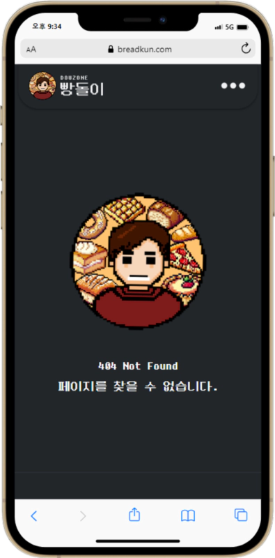

 

 
<!-- Index -->

**Index**

<ul>
    <li><a href="#overview">Overview</a></li>
    <li><a href="#introduction">Introduction</a></li>
    <li><a href="#configuration">Configuration</a></li>
    <li><a href="#roadmap">Roadmap</a></li>
    <li><a href="#stacks">Stacks</a></li>
   <li><a href="#browser-support">Browser Support</a></li>
   <li><a href="#members">Members</a></li>
</ul>

---

# Overview

- **프로젝트명**: Breadkun(빵돌이)

- **기간**: 2023.04.04. ~ 2023.05.23.

- **목표**: 더존ICT 구내식당과 사내베이커리 식단, 통근 버스 정류장 정보 및 실시간 도착 시간을 안내하는 웹 서비스.

- **배포주소**: https://breadkun.com/

**현재 README.md에서는 FRONT-END 관련 내용만을 서술합니다.**

**BACK-END 관련 내용은 PARK(BACK-END)의 게시물을 참고하세요.**

# Introduction

**Breadkun(빵돌이)은** 더존ICT 구내식당과 사내베이커리 식단, 통근 버스 정류장 정보와 실시간 도착 시간을 손쉽게 확인할 수 있는 웹 서비스입니다.

**주요 기능**:

- **식단**: Breadkun을 통해 더존ICT 구내식당과 사내베이커리의 다양한 식단을 빠르고 간편하게 확인할 수 있습니다. 사용자들의 건강한 식사 계획을 세우기에 효과적입니다.

- **통근 버스 정보**: Breadkun은 더존ICT 통근 버스 정보를 제공합니다. 사용자들은 특정 버스 노선의 정류장 위치, 실시간 도착 예정 시간을 확인할 수 있어 교통 계획을 효율적으로 조정할 수 있습니다.

- **대시보드**: 대시보드에는 더존ICT 회사 위치 기반의 날씨와 미세먼지 농도 정보가 표시됩니다. 또한, 사용자들이 자주 이용하는 기능에 빠르게 액세스할 수 있는 단축 아이콘을 제공하여 사용자 편의성을 최대화합니다.

- **모바일 최적화 및 사용자 경험**: Breadkun은 모바일 환경에 최적화된 디자인을 가지고 있습니다. 다양한 모바일 디바이스에서 사용자들은 직관적이고 일관된 사용자 경험을 얻을 수 있으며, 모바일 앱과 유사한 편리함을 느낄 수 있습니다.

- **PWA**: Breadkun은 Progressive Web App (PWA)로 제공되어, 사용자들이 웹 브라우저에서 손쉽게 앱 형태로 이용할 수 있습니다. 사용자들은 앱 설치 없이도 편리하게 Breadkun을 이용할 수 있으며, 지속적인 업데이트로 완성도와 사용성을 개선할 예정입니다.

- **반응형 웹(Responsive Web)**: 다양한 디바이스와 화면 크기에서 최적의 사용자 경험을 제공합니다. 데스크톱, 태블릿, 스마트폰 등 다양한 환경에서 편리하게 이용할 수 있습니다.

향후 추가적인 기능과 개선사항이 예정되어 있으며, 사용자들의 피드백과 요구를 반영하여 지속적으로 업데이트 할 예정입니다.

# Configuration

## PC

|  |  |  |  |
| :----------------------------------------------------------: | :----------------------------------------------------------: | :----------------------------------------------------------: | :----------------------------------------------------------: |
|                        더존(강촌)메인                        |                        더존(을지)메인                        |                        더존(강촌)식단                        |                        더존(을지)식단                        |

|  |  |  |  |
| :---------------------------------------------------------: | :----------------------------------------------------------------: | :-----------------------------------------------------------------: | :------------------------------------------------------: |
|                       더존(강촌)버스                        |                           더존(강촌)버스                           |                           더존(강촌)버스                            |                        404페이지                         |

## Mobile

|  |  |  |  |  |
| :-------------------------------------------------------: | :-------------------------------------------------------: | :-------------------------------------------------------: | :-------------------------------------------------------: | :------------------------------------------------------: |
|                      더존(강촌)메인                       |                      더존(을지)메인                       |                      더존(강촌)식단                       |                      더존(을지)식단                       |                       더존(강촌)빵                       |

|  |  |  |  |  |
| :------------------------------------------------------: | :-------------------------------------------------------------: | :--------------------------------------------------------------: | :---------------------------------------------------------: | :-------------------------------------------------: |
|                      더존(강촌)버스                      |                         더존(강촌)버스                          |                          더존(강촌)버스                          |                       네비게이션메뉴                        |                      404페이지                      |

# Roadmap

- [x] 최근 옵션(회사, 버스종착지) 저장 (local storage)
- [x] 식단(Meal)의 일주일 날짜 표시 및 현재 날짜 및 식단 자동 선택 로직
- [x] 빌드 및 배포 자동화; CI/CD (GitHub Actions, Firebase)
- [x] SEO(Search Engine Optimization) 설정
- [x] PWA(Progressive Web App) 설정
- [x] 대시보드(Home)의 날씨와 미세먼지 Api 연결 (Open Api)
- [x] 버스(Bus)에서 사용자 현재위치 정보 가져오기 (Web Api)
- [x] 버스(Bus)의 현재위치와 각종 정류장 위치정보 맵에 표시 (Kakao Api)
- [x] 버스(Bus)의 현재위치로 부터 남은시간 받는 Api 연결 (Back-end)
- [x] 카카오톡 플러스친구에서 링크 제공을 위한 URL 파라미터 (react-router-dom)
- [x] Api Key env 저장
- [x] 404Ppage
- [x] Cross-browsing을 위한 CSS reset (styled-reset)
- [x] Router (react-router-dom)
- [x] 반응형 웹(Responsive Web)
- [ ] PWA 개선
- [ ] 카페, 빵돌이오마카세 페이지

# Stacks

- **Environment**:    

- **Developement**:
    - **FRONT-END**:    
    - **BACK-END**:  

# Browser Support

  

# Members

- **HONG(FRONT-END)**

    - **GitHub**: https://github.com/coldair426
    - **Blog**: https://velog.io/@coldair426
    - **Mail**: coldair426@gmail.com

- **PARK(BACK-END)**
    - **GitHub**: https://github.com/pannchat
    - **Blog**: https://pannchat.tistory.com/

---

**Full README가 보고 싶다면 [velog](https://velog.io/@coldair426/series/breadkun)를 참고하세요.**
